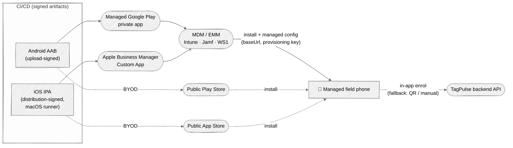

# Design — production distribution (iOS + Android)

> **Summary.** How the TagPulse-Mobile app gets from a signed build onto a **field
> worker's phone in production** — the layer *above* the in-app enrolment flow. The
> driving decision is **device ownership**: a company-managed fleet (MDM/EMM +
> private/managed distribution, the recommended path for field workers) vs BYOD
> (public app stores). Managed distribution additionally lets an MDM **push the
> enrolment config** (`baseUrl` + provisioning key) so onboarding is zero-touch.
> **Nothing here is built yet** — this is the roadmap for a future "distribution"
> phase; it records the options, the repo-specific gaps, and the decisions to make.

## Context

Regen: edit the Mermaid above; source of truth for the diagram is this block.

## Why: device ownership drives everything

Pick this first — it selects the distribution channel, the onboarding UX, and the
tooling:

- **Company-managed devices (recommended for field workers).** Org-owned phones enrolled
  in an **MDM/EMM** (Microsoft Intune, Jamf, VMware Workspace ONE, …). Unlocks zero-touch
  device enrollment, remote wipe, kiosk/managed-app mode, and — the high-value one —
  **managed app configuration** that pushes the app's enrolment settings so a worker never
  types a URL or scans a QR.
- **BYOD / personal devices.** Workers install from the public stores. Simpler to publish,
  but no managed config — you lean entirely on the in-app QR/manual enrolment
  ([`enrolment-flow.md`](enrolment-flow.md)).

> **Assumption (`unverified`):** the target is a **managed field fleet**, not consumer
> BYOD — this doc recommends the managed path but documents both. Confirm with the
> deployment owner before committing tooling.

## Android

| Path | When | Mechanism |
|---|---|---|
| **Managed Google Play private app** *(recommended)* | Company fleet | Publish a **private** app scoped to your org; the EMM assigns it to managed devices. Supports **managed configuration** (`AppRestrictions`) to push `baseUrl` + provisioning key. |
| **Public Play Store** | BYOD | internal → closed → open testing tracks → Production. |
| **Direct APK via MDM** | Air-gapped / edge | MDM pushes the signed APK; no Play dependency. |

**Mechanics**

- Ship an **AAB** (App Bundle) to Play, not a bare APK.
- Use **Play App Signing** — Google holds the app-signing key; you hold an **upload** key.
- Publishing tooling: **Gradle Play Publisher** or **fastlane supply** from CI.

## iOS

| Path | When | Mechanism |
|---|---|---|
| **Custom Apps via Apple Business Manager** *(recommended)* | Company fleet | Private app distributed through **ABM** to your org, assigned to devices/users via MDM; not publicly listed. |
| **App Store** | BYOD / consumer | App Store Connect submission + review. |
| **Apple Developer Enterprise Program** (in-house `.ipa`) | Very large orgs, internal only | Apple restricts eligibility and discourages it; prefer ABM Custom Apps. |

**Mechanics**

- Requires **Apple Developer Program** + a **distribution certificate** + provisioning
  profiles; **Apple Business Manager** for the managed/Custom-App path.
- iOS **Managed App Configuration** is the iOS equivalent of Android's managed config.
- Publishing/signing tooling: **fastlane** (`match` for certs/profiles, `deliver`/`pilot`
  for App Store Connect / TestFlight), on a **macOS runner**.

## The high-value tie-in: managed config → enrolment

The app already enrols via `baseUrl` + provisioning key + tenant `tp_` key →
`POST /devices/provision` → secure store ([`enrolment-flow.md`](enrolment-flow.md)). On
managed devices, the MDM can **inject `baseUrl` + provisioning key** so onboarding is
zero-touch:

- **Android:** managed configurations (`AppRestrictions`).
- **iOS:** Managed App Configuration.

**Proposed onboarding precedence:** MDM managed config → **fallback** QR scan → **fallback**
manual entry. The tenant **`tp_` ingest key stays out of broadly-pushed config** (mirrors
enrolment OQ2: the QR carries only base + provisioning key); use a per-device managed
secret or keep it on the QR/manual path.

> This is a **forward-looking proposal**, not an implemented behavior — the enrolment
> reader would need an MDM-config source added ahead of the existing QR/manual sources.

## CI/CD shape

- **Android:** CI builds a **signed AAB** → uploads to Play (internal track → promote) via
  Gradle Play Publisher / fastlane supply.
- **iOS:** a **macOS runner** builds a **signed IPA** → App Store Connect / ABM via
  fastlane.
- Both gated behind the existing test gates ([`AGENTS.md`](../../AGENTS.md) §3). The Android
  gate is real today; the iOS gate arrives with the iOS codebase.

## Repo-specific gaps (must close before shipping)

These are current-state facts that block production distribution:

- **Android release is debug-signed.** `app/build.gradle.kts` signs the minified `release`
  with the **debug keystore** (an explicit Phase-0 placeholder). A real upload/release
  keystore + Play App Signing enrollment is required before publishing.
- **No iOS codebase exists.** Native Swift is a locked decision (D3) but unbuilt — the
  entire iOS path above is future ([`current-state.md`](../current-state.md)).
- **Footprint: the bundled ML Kit scanner pushed the release APK ~2.3 MB → ~24 MB**
  (enrolment OQ1, [`enrolment-flow.md`](enrolment-flow.md)). For Play, consider **Play
  Feature Delivery / on-demand model download** to shrink the base install — directly
  serves the footprint-first constraint ([`AGENTS.md`](../../AGENTS.md) §2).
- **Secrets rule holds:** signing keys and tenant keys never enter source or the bundle;
  keys live in CI secret stores / the platform secure store ([`AGENTS.md`](../../AGENTS.md)
  §2).

## Prerequisites checklist

- [ ] Decide **managed fleet vs BYOD** (drives everything above)
- [ ] Google Play Console account + **Managed Google Play / Android Enterprise** (if fleet)
- [ ] Apple Developer Program + **Apple Business Manager** + an **MDM** (Intune/Jamf/WS1)
- [ ] Real **Android upload/release keystore**; enroll in **Play App Signing**
- [ ] iOS **distribution certificate** + provisioning (once the iOS app exists)
- [ ] CI publish jobs (AAB → Play; IPA → App Store Connect/ABM on a macOS runner)
- [ ] Address the **24 MB ML Kit footprint** (on-demand model) before a public/base install
- [ ] Design **MDM managed-config → enrolment** precedence (config → QR → manual)

## Open questions

- **D-1 — managed vs BYOD** (or both). The single decision that selects channels + tooling.
- **D-2 — which MDM/EMM** the org standardizes on (Intune vs Jamf vs Workspace ONE) — sets
  the managed-config schema + enrollment model.
- **D-3 — tenant `tp_` key delivery on managed devices** — per-device managed secret vs
  keep on the QR/manual path. Security review before choosing.
- **D-4 — first platform to distribute** (mirrors mobile-client Q-C: iOS+Android together
  or one first).

> Program specifics for **Managed Google Play** and **Apple Business Manager Custom Apps**
> shift over time — verify current terms/eligibility at publish time (`unverified`).

## Related

- **Above the OS install:** in-app onboarding — [`enrolment-flow.md`](enrolment-flow.md).
- **Overall design + phased plan:** [`mobile-client.md`](mobile-client.md) (distribution is
  a future phase beyond Phase 3).
- **Where we are now:** [`current-state.md`](../current-state.md).
- **Hard rules (secrets, footprint, native-only):** [`AGENTS.md`](../../AGENTS.md).

## Review attestations

- **Plan-stage rubber-duck:** n/a — `noncodefix` carve-out (docs-only design proposal; no
  code / deps / CI / security / behavioral config changed).
- **Diff-stage rubber-duck:** n/a — same carve-out.
