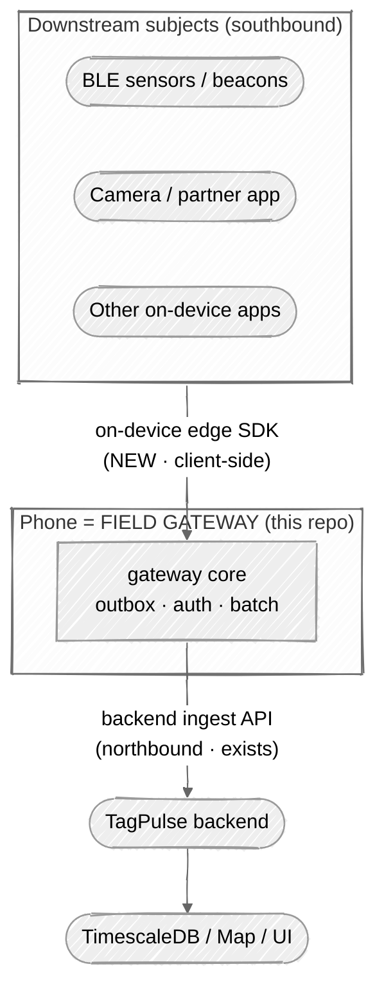

# Exploration — the phone as a mobile edge *gateway* (forward-looking)

> **Status:** exploration / proposal (not committed scope). **Intent:** capture a design
> conversation that reframes the phone from an *endpoint device* to an *edge gateway*, so
> the thinking isn't lost when the roadmap reaches it. **Nothing here changes v1 (Phase
> 0/1)** — see [Sequencing](#sequencing). Companion to the main design:
> [`mobile-client.md`](mobile-client.md). On conflict, the main design + the backend
> `openapi.json` contract win.
>
> Several claims below are marked **`unverified`** — they depend on the TagPulse backend,
> which is *not* in this repo (the backend is the contract; see repo `AGENTS.md`).

## Summary

The main design treats the phone as a **first-class edge *device*** — it reports *itself*
(camera reads, its own GPS + sensors). This note explores the next step up: the phone as a
**mobile edge *gateway*** that **fronts many downstream subjects** it can't natively be —
nearby **BLE beacons/sensors**, and even **other apps on the same handset** — and relays
their reads + metrics + a location stamp through one durable outbox.

The key realisation: **a fixed RFID reader is already exactly this** — a gateway that reads
many tags and relays them. So "phone as gateway" is not a new backend concept, it's *"a
second gateway/reader type"* — the main design's own framing (*"second device type
alongside fixed RFID readers"*), upgraded from **device** to **gateway**.

Regenerate: edit the fenced Mermaid above. Context-0 view; boundaries = trust/ownership zones.

## Two capabilities hiding in "gateway" (very different scope)

| | **A — sensor / BLE aggregation** | **B — local ingest SDK / relay** |
|---|---|---|
| What | Phone scans BLE devices/sensors, reads IDs + metrics, uploads them | Other on-device apps push observations *through* the mobile client |
| Analogy | A mobile RFID reader — BLE/camera instead of UHF | The mobile client becomes an **edge SDK / ingest agent** |
| Scope | A reader **feature** (Phase 2/3) | A **platform** decision — you become infrastructure, not just an app |

## Southbound vs northbound — where the "SDK" actually lives

A recurring point of confusion, resolved: **the SDK other apps call is *client-side* (on
the phone), not backend.**

| Interface | Runs | Built by | Backend? |
|---|---|---|---|
| **Southbound** — the edge SDK other apps call to hand you observations | On the phone, in/next to the mobile client | You (this repo — Swift + Kotlin) | No — client-side |
| **Northbound** — the ingest API the phone POSTs to | Server | Backend team | Yes — but already exists |

So: *the phone **is** the gateway; it **exposes** an on-device (southbound) SDK other apps
push into; and it **uses** the backend's (northbound) ingest API to relay upward.* There is
**no separate "backend gateway SDK" to build** — to the backend, the phone is just a client
hitting the existing endpoints, regardless of whether a reading came from the app's own UI,
a BLE sensor, or a partner app.

**Southbound SDK shapes** (cheapest → richest): in-process library · **local IPC** (Android
bound service / iOS App Group + shared container) · on-device loopback HTTP. The footprint
budget (main design §Footprint) likely rules out the loopback server; **IPC is the sweet
spot** for genuine third-party apps.

## How it maps onto the *existing* backend primitives

| Downstream signal | Existing endpoint / table | Note |
|---|---|---|
| BLE beacon ID / camera / NFC read | `POST /tag-reads[/batch]` → `tag_reads` | A BLE beacon read *is* a tag read. |
| BLE sensor metric (temp, battery…) | `POST /telemetry/readings/ingest` → `telemetry_readings` | Already `subject_kind='device'`, **subject-scoped per row** — a batch can carry *many* subjects. |
| Location for a subject that can't self-locate | `POST /assets/{id}/external-position` | Gateway **provides location**: stamp the phone's fix + accuracy onto each read. |

## Generalized gateway core + per-modality drivers (the reusable idea)

The goal the conversation converged on: **one portable gateway core, many gateway *types*,
without rewriting the SDK each time you onboard a new modality.** Industry calls this a
**core + pluggable device/protocol drivers** architecture. Split into two layers:

1. **Portable gateway core** — outbox · auth · batching · northbound backend client. Write
   once.
2. **Thin driver interface** — `discover → read → normalize`, implemented per modality
   (camera, BLE, NFC, other-app relay).

Onboarding a "new gateway type" then = **a new driver, not a new SDK**.

**Mobile caveat (`unverified` in the general case, but firm for iOS):** unlike Linux
gateways, iOS/Android **sandboxing + background/footprint limits** mean you can't
hot-load arbitrary drivers (esp. iOS). On a phone this is **compile-time drivers behind a
common interface**, not runtime plugins.

### Industry references (prior art)

Core-plus-driver gateway frameworks:
- **EdgeX Foundry** — Device Service SDK is literally "driver per protocol, reuse core":
  <https://www.edgexfoundry.org/> · docs <https://docs.edgexfoundry.org/>
- **Eclipse Kura** — Java/OSGi **Driver + Asset** model: <https://eclipse.dev/kura/>
- **ThingsBoard IoT Gateway** — config-driven **connectors**:
  <https://thingsboard.io/docs/iot-gateway/> · <https://github.com/thingsboard/thingsboard-gateway>

Edge runtimes (gateway host + deployable modules):
- **Azure IoT Edge** <https://learn.microsoft.com/azure/iot-edge/> ·
  **AWS IoT Greengrass** <https://aws.amazon.com/greengrass/>

"Describe any device without new code" abstraction (the holy grail):
- **W3C Web of Things — Thing Description** <https://www.w3.org/WoT/> ·
  arch <https://www.w3.org/TR/wot-architecture11/>
- **Eclipse Thingweb `node-wot`** <https://thingweb.io/> ·
  <https://github.com/eclipse-thingweb/node-wot>
- **OMA LwM2M** <https://www.openmobilealliance.org/specifications/lwm2m> ·
  **Sparkplug B** <https://sparkplug.eclipse.org/>

Portable BLE-gateway precedents (the "run it on other/cheap hardware" angle):
- **Theengs Gateway** — BLE→MQTT with a pluggable **decoder** library:
  <https://gateway.theengs.io/> · <https://github.com/theengs/gateway>
- **ESPHome Bluetooth Proxy** <https://esphome.io/components/bluetooth_proxy.html> ·
  **Akri (CNCF)** leaf-device discovery <https://docs.akri.sh/>

Research — WoT abstraction applied to BLE:
- <https://arxiv.org/abs/2211.12934>

## Impact on the open questions

- **Q-A (principal) changes shape.** A gateway must write telemetry for subjects it *does
  not own*, so the earlier least-privilege idea ("a device writes *only its own* subject")
  is **too restrictive**. Option A becomes a **gateway-scoped principal** authorised to
  relay for a *set/namespace* of downstream subjects — exactly what a fixed reader already
  has. This makes the **MQTT-impact analysis (ledger `I-F0PR`)** central: mirror how fixed
  readers authorise telemetry for the tags they relay.
- **Q-B (position) changes shape.** No longer "what asset *is the phone*" but **two things
  at once**: (1) the phone's own track (B1/B3), **and** (2) a **per-read location stamp**
  applied to each downstream subject. B1/B2/B3 stop competing — the gateway does both.

## New questions this model raises

- **G-1 — downstream subject provisioning & trust.** When the phone sees a new BLE ID, does
  the backend auto-create a device subject, or must it be pre-registered/approved? BLE IDs
  are **spoofable** → need attestation or an admin-approve step (mirror
  `device-registry/{id}/approve`). *Biggest trust question.* **[backend decision]**
- **G-2 — mixed-subject batch.** Do `/tag-reads/batch` and the telemetry batch endpoint
  accept **many subjects in one payload**? (Likely yes — subject-scoped per row — but it's
  the linchpin of relay.) `unverified` **[backend contract check]**
- **G-3 — position provenance.** Does `external_locations` carry a **source/priority**
  field? Needed if the phone is a *backup/secondary* locator alongside built-in vehicle
  telematics (two streams, one asset). `unverified` **[backend]**
- **G-4 — southbound SDK trust model.** Which apps may push through the relay, and what
  subject may each claim? Needs an **app allowlist + per-app subject scoping**, or one
  compromised app forges data for anything.
- **G-5 — footprint.** Continuous BLE scanning + staying alive as relay infrastructure both
  push against the main design's first-class footprint budget. Quantify before committing.
- **G-6 — strategic fork.** Are we building a mobile **app**, or a mobile **edge
  gateway/SDK platform**? Everything above branches on this. *Roadmap decision, not a
  Phase-1 checkbox.*

## Sequencing

- **v1 (Phase 0/1) stays phone-as-endpoint** — do **not** build the gateway yet.
- **One cheap hedge now:** have the outbox key every item by an explicit **`subject` +
  `source`**, not an implicit "self." This keeps the gateway door open at near-zero cost.
- **Capability A (BLE aggregation)** → natural **Phase 2/3** reader modality, reusing
  `tag_reads` / `telemetry` as-is.
- **Capability B (ingest SDK)** → a **separate product/strategic decision** (G-6), not a
  feature.
