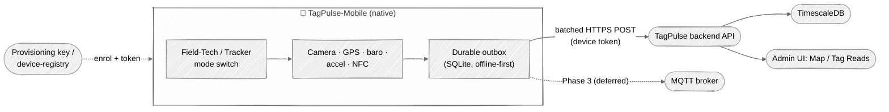

# Design — TagPulse Mobile client

> **Status:** draft (Sprint TBD). **Intent:** explanation + reference for the mobile
> edge client. **Backend contract source of truth:** TagPulse `openapi.json` — this doc
> describes *how the phone speaks it*, not the API itself. On conflict, the backend
> contract wins.

## Summary

TagPulse-Mobile is a **native phone client** (iOS + Android) that turns a field
worker's handset into a first-class TagPulse **edge device**. It is a second device
type alongside fixed RFID readers: instead of a UHF antenna, the "reads" come from the
**camera** (QR / 1D barcode / DataMatrix, plus short-range NFC), and the phone adds
**sensor telemetry** a fixed reader never had — GPS, barometric altitude, accelerometer,
magnetometer, battery.

It ships as a **hybrid app with a mode switch**:

- **Field-Tech mode** (foreground) — scan an asset/label, look it up, run a guided task
  (cycle count, inspection), attach a photo/GPS fix on demand. Battery-light,
  permission-light.
- **Tracker mode** (background) — the phone acts as a moving beacon on an asset/vehicle,
  streaming batched GPS + motion telemetry. Battery/OS-throttling heavy.

The app is **offline-first** and **HTTP-first**: every observation lands in a local
durable outbox and is drained as batched HTTPS POSTs when connectivity allows. No
persistent MQTT socket in v1.

### Context

Regen: edit the Mermaid above; source of truth for the diagram is this block.

## Goals

- Reuse the **existing backend contract** — ship zero backend changes for Phase 0.
- One durable **offline outbox** + batched HTTPS upload shared by both modes.
- Small install + low RAM footprint (native chosen precisely for this — see
  [Decisions](#decisions)).
- Enrol a phone as a `device` with a rotatable token, no hand-registration.

## Non-goals (v1)

- **Passive UHF RFID.** Phones have no UHF radio; a Bluetooth RFID sled is a later,
  separate integration.
- **MQTT / real-time downlink & cloud-to-device commands** — deferred to Phase 3.
- **mTLS / hardware-backed device keys** — the backend roadmap Phase 3 (ADR-011);
  v1 uses rotatable bearer tokens.
- Cross-platform UI framework / shared UI code — this is two native codebases by design.

## Decisions

Locked with the product owner on 2026-07-23 (this session):

| # | Decision | Choice | Why |
|---|---|---|---|
| D1 | Repo shape | **Separate repo** `9owlsboston/TagPulse-Mobile`, bootstrapped profile `xs` | Independent release cadence from backend/UI; shares only the generated API client + this contract. |
| D2 | Use case | **Hybrid** app with a **mode switch** (Field-Tech + Tracker) | Owner wants both foreground scan/inspect and background asset tracking in one app. |
| D3 | Framework | **Native** — Swift (iOS) + Kotlin (Android) | Smallest install size, lowest runtime RAM, best background-GPS/sensor fidelity. Footprint was a stated priority. Cost: ~2× work, no code reuse. |
| D4 | Transport | **HTTP-first** (batched POSTs + offline outbox); MQTT deferred | Battery-friendly on a background-constrained handset; no persistent socket; simplest on native. Backend accepts both. |

Framework tradeoff analysis (RN/Expo vs Flutter vs Native — footprint, RAM, background,
velocity) is recorded in the session that produced this doc; D3 is the outcome.

## Architecture

Two native apps, **one contract**. Shared, non-UI concerns are specified here and
implemented twice (Swift / Kotlin) against a **generated API client** so the wire shape
can never drift from the backend:

- **API client** — generated from TagPulse `openapi.json` (Swift: `swift-openapi-generator`
  or `openapi-generator`; Kotlin: `openapi-generator`). Each generation **records the
  backend commit SHA** the `openapi.json` came from (mirrors the TagPulse ↔ TagPulse-UI
  contract-handoff rule).
- **Outbox** — local durable queue (SQLite / Core Data / Room). Every `submit_*` writes
  inline and returns; a background drainer batches and POSTs on connectivity. Bounded by
  size + max age; process-restart safe. Mirrors the reference edge client
  (`TagPulse/clients/pi/tagpulse_edge`).
- **Uploader** — batched HTTPS with full-jitter exponential backoff; `URLSession`
  (background config) / `OkHttp` (+ `WorkManager`). Idempotency via a client-generated
  event id so retries don't double-write.
- **Time hygiene** — all timestamps UTC; drop events older than 24 h / >5 min in the
  future locally (matches the edge contract).
- **Mode switch** — a single toggle selects the active collectors. Tracker mode owns the
  background location task (`CLLocationManager` background updates / a foreground service
  + `FusedLocationProvider`); Field-Tech mode is foreground-only.

### Data paths → backend endpoints

Every observation maps to an **already-existing** backend endpoint (no backend work for
Phase 0):

| Phone signal | Backend endpoint | Table | Notes |
|---|---|---|---|
| Camera QR/barcode/NFC scan | `POST /tag-reads` · `POST /tag-reads/batch` | `tag_reads` | The phone's "tag read". Batch is the outbox drain path. |
| On-demand / background GPS fix | `POST /assets/{asset_id}/external-position` | `external_locations` | Feeds the Map + geofencing; `devices.mobility='mobile'`. Asset-bound. |
| Sensor metrics (baro/accel/battery) | `POST /telemetry/readings/ingest` (batch) | `telemetry_readings` | Subject-scoped (`subject_kind='device'`). **⚠ role-gated `admin`/`editor`** — see Open Questions Q-A. |
| Ack an alert (Field-Tech) | `POST /alerts/{alert_id}/acknowledge` | `alerts` | Optional Phase 2. |

### Enrolment & identity

Uses the backend's existing provisioning flow (no new endpoints):

1. Phone posts `POST /devices/provision` with an `X-Provisioning-Key` (tenant key,
   entered once via QR at enrolment) → receives a device identity.
2. Admin approves in the UI: `POST /device-registry/{device_id}/approve`.
3. Token stored in the **platform secure store** (iOS Keychain / Android Keystore);
   rotated via `POST /device-registry/{device_id}/rotate-token`.
4. mTLS (`POST /device-registry/{device_id}/cert`) and hardware-backed keys are the
   backend's identity Phase 2/3 (ADR-011/012) — **deferred** here.

## Footprint budget (native was chosen for this — hold the line)

Targets, not yet measured (`unverified` until Phase 0 builds exist):

- Install size added by our code + deps: keep lean; avoid heavy cross-platform runtimes
  (the reason RN/Expo was not chosen).
- Prefer platform-native camera/scan (VisionKit/MLKit) over bundling a scanner engine.
- Outbox DB capped by size + age; images stored as file refs, not inline blobs.

## Phased plan

- **Phase 0 — spike (zero backend change).** Native shell (both platforms or one first),
  enrol via provisioning key, camera scan → `POST /tag-reads`, one GPS fix →
  `external-position`. Watch it appear on the existing **Map** + **Tag Reads** grid.
- **Phase 1 — hardening.** Durable outbox, batching, backoff/reconnect, heartbeat, secure
  token storage + rotation, sensor telemetry, the mode switch.
- **Phase 2 — field workflows.** Asset lookup, guided cycle-count / inspection tasks,
  alert acknowledge, push notifications.
- **Phase 3 — extensions.** Optional MQTT transport, mTLS / hardware keys, BLE UHF-RFID
  sled, v2 wire format / presence where it buys something.

## Open questions

- **Q-A — device principal & role.** `POST /telemetry/readings/ingest` is gated to
  `admin`/`editor`; a provisioned **device** is neither. Does the phone authenticate as a
  device (and do we need a device-scoped telemetry ingest path), or as a user? Resolve
  before Phase 1 telemetry. **[backend decision]**
  - **Leaning Option A** (device principal + device-scoped ingest path) — consistent with
    `telemetry_readings.subject_kind='device'` and avoids putting a privileged
    `admin`/`editor` user credential on a field handset.
  - **TODO (backend, prerequisite): MQTT-impact analysis.** The fixed RFID readers already
    write device telemetry via MQTT, so Option A is likely additive — but confirm before
    committing: (1) does the RFID MQTT client already write `subject_kind='device'` rows?
    (2) is ingest authorization shared between the HTTP and MQTT paths, or separate? Only a
    shared-authz refactor would touch the existing reader fleet.
- **Q-B — asset binding.** `external-position` is per-`asset_id`. In Tracker mode, what is
  the phone bound to — a dedicated "phone asset" (**B1**), the vehicle asset (**B2**), or
  the device itself (**B3**)? (`external_locations` is asset-keyed today.)
  - Use-case driven: **B1** = MDM / inventory-of-phones (zero backend change); **B2** =
    fleet (but vehicles usually already have built-in telematics → phone is a *backup/
    gap-filler* → raises a position-**provenance** question, see exploration G-3); **B3** =
    device-keyed position (needs a backend schema change, but is the coherent endpoint if
    Q-A goes Option A).
  - **Leaning B1 to ship → B3 as the documented target.** If the gateway model (below) is
    adopted, Q-B stops being either/or: the gateway both tracks *itself* and *location-
    stamps every downstream subject it reads*.

> **Forward-looking:** a broader conversation reframed the phone from an edge *device* to a
> mobile edge **gateway** (fronting BLE sensors + relaying for other on-device apps via an
> on-device SDK), and how a **generalized gateway core + per-modality drivers** could make
> it portable across gateway types. Captured — with industry prior art and the new
> questions G-1…G-6 it raises — in
> [`edge-gateway-exploration.md`](edge-gateway-exploration.md). **Not v1 scope.**
- **Q-C — first platform.** Ship iOS and Android together, or one first for the Phase 0
  spike?
- **Q-D — background tracking policy.** Continuous vs significant-change vs geofence-wake
  in Tracker mode (battery vs fidelity).

## Review attestations

<!-- SDLC gate — fill before merge -->

- **Plan-stage rubber-duck:** _pending_ (draft; to run before implementation).
- **Diff-stage rubber-duck:** n/a (docs-only scaffold so far).
