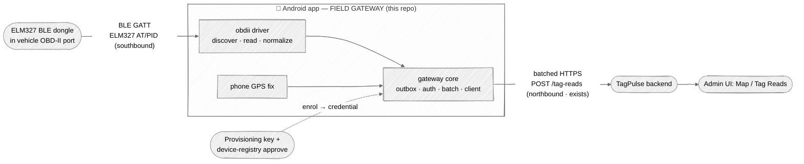

# Plan — OBDII-on-demand MVE (Phase-0, first gateway modality)

> **Status:** plan / proposal — **not committed scope** until approved (gates the
> `implementer`). **Intent:** a file-by-file, milestone-by-milestone build plan for the
> minimum viable experiment (MVE) named in
> [`edge-gateway-exploration.md` § MVE prospect](edge-gateway-exploration.md#mve-prospect--obdii-on-demand-candidate-first-gateway-modality).
> This plan does **not** relitigate the design decisions captured there or in
> [`mobile-client.md`](mobile-client.md) — it plans *within* them. On conflict, those
> design docs + the TagPulse `openapi.json` contract win.
>
> Contract facts below were re-verified against the sibling backend repo
> (`~/ws/TagPulse`, project `tagpulse`, `main` @ `06dde2b`) on 2026-07-24; claims that
> could **not** be pinned to backend code are marked **`unverified`**.

## Summary

Prove the phone-as-field-gateway thesis with the cheapest possible end-to-end slice:

> **Android app** BLE-connects a **~$25–30 ELM327-over-BLE OBD-II dongle** → reads four
> J1979 PIDs (RPM, speed, coolant temp, fuel %) → normalizes a snapshot → drops it in a
> durable **outbox** → drains it as a batched `POST /tag-reads` (the phone's provisioned
> **device_id**, GPS in the `location` sub-model) → the read appears on the existing
> **Map**.

It is deliberately **green-zone**: it uses the *existing* `tag-reads` ingest path with
**zero backend change**, models the vehicle as an **asset**, and runs **opportunistic /
foreground** (user taps "Scan vehicle") — so no `I-75YC` telemetry-principal ask, no
`I-9HQA` position-generalization ask, no always-on/background/battery fight. It exercises
the reusable **gateway core + thin `obdii` driver** seam for the first time on real
hardware, **Android-first** (resolves `Q-C` for this slice; iOS port follows on a
confirmed-BLE adapter).


<sub>Regenerate: edit the Mermaid above. Context-0 view; boundaries = trust/ownership zones.
Dongle & backend & UI are external (stadium) nodes; the phone box is the trust boundary this repo owns.</sub>

---

## 1. Goal & done-definition (acceptance criteria)

The MVE **works** when, on a single Android handset paired to a real (or emulated) ELM327
BLE dongle, an operator can:

| # | Acceptance criterion | Verification signal |
|---|---|---|
| A1 | Enrol the handset once (provisioning key → `device-registry` approve) and hold an ingest credential in the Android Keystore. | `POST /devices/provision` returns `device_id`; admin approve flips status → `active`; credential present in secure store, never in logs. |
| A2 | Discover + BLE-connect the dongle and complete the ELM327 init handshake. | Driver logs `ATZ`/`ATE0`/`ATSP0` round-trip; connection state = `connected`. |
| A3 | Read all four PIDs in one on-demand snapshot and normalize them to engineering units. | Unit test: canned ELM327 hex frames → expected `{rpm, speed_kph, coolant_temp_c, fuel_level_pct}`; a real read shows plausible values. |
| A4 | Persist the snapshot to the durable outbox and survive a process restart with it still queued. | Instrumented test: enqueue → kill process → relaunch → item still pending. |
| A5 | Drain the outbox as a batched `POST /tag-reads` and get a `201`; item marked sent, not re-sent. | HTTP `201`; backend returns `{ingested: N, rejected: 0}`; outbox row transitions `pending → sent` exactly once. |
| A6 | See the read on the existing TagPulse **Map** / **Tag Reads** grid at the phone's GPS location. | Manual: the pin appears; the PID snapshot is present in the row's `sensor_data`. |
| A7 | The per-platform gate is green. | `./gradlew lintDebug testDebugUnitTest assembleDebug` exits 0. |

**Non-acceptance (explicitly not required):** clean telemetry model, non-asset subjects,
background operation, multi-vehicle fan-in, DTC/VIN. See §2.

---

## 2. Scope

### In scope
- One **Android** app shell (foreground, user-initiated "Scan vehicle" action).
- A **gateway core** module (outbox · auth/credential · batching · backend client) and a
  thin **`obdii` driver** (`discover → read → normalize`) behind a common interface.
- BLE GATT transport to an **ELM327-over-BLE** dongle; the J1979 numeric-PID happy path
  for **exactly four PIDs**: `010C` RPM, `010D` speed, `0105` coolant temp, `012F` fuel %.
- Enrolment via the existing provision → approve flow; credential in Android Keystore.
- Relay via **`POST /tag-reads`** (single + batch drain), snapshot in `sensor_data`, GPS
  in the `location` sub-model.

### Out of scope (mirrors the prospect's exclusions)
- **Clean telemetry model** `POST /telemetry/readings/ingest` — admin/editor-gated, needs
  the scoped-gateway-principal ask (ledger **`I-75YC`**). *Later upgrade, not MVE.*
- **Non-asset subjects / position-generalization** (ledger **`I-9HQA`**) — vehicle = asset,
  so asset-scoped paths work as-is.
- **Always-on / mounted / background** deployment mode.
- **Multi-subject fan-in at scale** (many dongles / mixed-subject batches).
- **DTC** (diagnostic trouble codes — *events*) and **VIN** (*identity*) — outside the
  numeric-PID happy path.
- **iOS** — deferred to a follow-up port on a confirmed-BLE adapter.

---

## 3. Architecture — the core/driver seam

The whole point is to build the **portable gateway core once** and add modalities as
**drivers, not new SDKs** (per
[exploration § Generalized gateway core](edge-gateway-exploration.md#generalized-gateway-core--per-modality-drivers-the-reusable-idea)).
The MVE stands up that seam with its first driver.

```
app (Android UI: "Scan vehicle" button, status)
  │  calls
  ▼
gateway core  ── reused by every future modality ──────────────────┐
  • Outbox        durable local queue (Room), size + age capped     │
  • Credential    provision/approve + Keystore-backed ingest cred   │
  • Batcher       drains pending items → batched POST               │
  • BackendClient generated from openapi.json (records backend SHA) │
  • GatewayDriver interface:  discover() → read() → normalize()     │
  └────────────────────────────────────────────────────────────────┘
  ▲  implements
  │
obdii driver  ── the ONLY MVE-specific code ──
  • BleTransport      GATT connect, notify/write chars, MTU, timeouts
  • Elm327Session     AT init + PID request/response framing
  • PidCodec          hex frame → engineering units (pure, unit-tested)
  • normalize()       → the core's Observation model (subject + source)
```

**Where the seam is:** the `obdii` driver knows nothing about HTTP, auth, or the outbox;
the core knows nothing about BLE or ELM327. They meet at a single `GatewayDriver`
interface returning a normalized `Observation { subject, source, timestamp, payload,
location }`.

**Reused later (not rewritten):** outbox, credential/enrolment, batcher, backend client,
the driver interface, and the `Observation` shape all carry forward to camera/NFC/BLE-beacon
modalities and (much later) the clean telemetry path. Only a *new driver* is needed per
modality. The **cheap hedge** from
[exploration § Sequencing](edge-gateway-exploration.md#sequencing) is honored: every outbox
item keys an explicit **`subject` + `source`**, never an implicit "self."

---

## 4. Data mapping — OBD PIDs → `TagReadCreate`

**Verified `TagReadCreate` shape** (`~/ws/TagPulse` `src/tagpulse/models/schemas.py`):
`device_id: UUID` (required), `tag_id: str|None ≤256`, `timestamp: datetime`,
`signal_strength: float|None`, `sensor_data: dict|None`, `location: Location|None`,
`identity: Identity|None`, `tag_data: dict|None`, `reader_antenna: int|None (0–255)`.
`Location` = `{latitude (−90..90), longitude (−180..180), accuracy_m: float|None ≥0,
source: Literal["gps","fixed","inferred","reader_gnss"] = "gps"}`.

> ⚠ **Correction to carry forward:** the sub-model field is **`accuracy_m`** (not
> `accuracy_meters`) and `source` is a fixed `LocationSource` enum — the MVE's GPS stamp
> uses `source: "gps"`. Noted so the generated-client mapping doesn't drift.

| `TagReadCreate` field | MVE value | Note |
|---|---|---|
| `device_id` | the **phone-gateway's** provisioned device UUID | The gateway is the reporting device (§5). Obtained at enrolment, cached in secure store. |
| `tag_id` | the **vehicle asset's** registered tag/label id | Binds the read to the vehicle asset. **Assumption `unverified`:** the vehicle asset already has a tag registered in TagPulse; the operator selects/enters it at bind time (§5). If absent, the read still lands + shows on the Map via `location`, just unlinked. |
| `timestamp` | snapshot capture time (UTC) | Clock hygiene: backend rejects >24 h old / >5 min future and dead-letters them (edge-device-contract §3.5) — the outbox drops stale items locally first (mirrors [`mobile-client.md` Time hygiene](mobile-client.md#architecture)). |
| `sensor_data` | the **PID snapshot JSON** (below) | The green-zone home for the OBD payload — no backend change. |
| `location` | phone GPS fix → `{latitude, longitude, accuracy_m, source:"gps"}` | Drives the Map pin (A6). On-demand single fix, not a track. |
| `signal_strength` | *(optional)* BLE RSSI of the dongle link | Free, mildly useful; omit if noisy. |
| `identity` / `tag_data` / `reader_antenna` | unused (MVE) | RFID-specific; leave `null`. |

**Proposed `sensor_data` snapshot shape** (stable, self-describing so a later reader can
tell it came from the OBD modality):

```json
{
  "modality": "obdii",
  "protocol": "elm327/j1979",
  "captured_at": "2026-07-24T21:00:00Z",
  "pids": {
    "rpm":            850,
    "speed_kph":      0,
    "coolant_temp_c": 89,
    "fuel_level_pct": 47.5
  },
  "dongle": { "ble_name": "OBDII", "adapter": "elm327", "elm_version": "1.5" },
  "raw": { "010C": "41 0C 0D 48", "010D": "41 0D 00" }
}
```

- `pids` = the normalized engineering-unit values (the point of the read).
- `raw` = the source ELM327 frames, **optional / debug-gated** — invaluable for
  field-debugging clone quirks (§9) but droppable to stay within footprint.
- `modality`/`protocol`/`captured_at` = provenance so the payload self-identifies.

**On-demand snapshot semantics:** one user-initiated action = **one** snapshot = **one**
`tag_read` row (or a small batch if several PIDs are split). Not a stream; no sampling loop
in the MVE.

---

## 5. Enrolment / binding flow

Two distinct bindings — **handset↔tenant** (once) and **dongle↔vehicle-asset** (per
vehicle). Both use *existing* backend primitives (re-verified in
`src/tagpulse/api/routes/provisioning.py`):

**Handset enrolment (once per phone):**
1. `POST /devices/provision` with an `X-Provisioning-Key` header → returns
   `{device_id, status: "pending", message}`. The key is a **tenant** provisioning key,
   entered once at setup (QR scan is the intended UX, per `mobile-client.md`).
2. Admin approves: `POST /device-registry/{device_id}/approve` (admin-only, `204`) →
   status `active`.
3. Cache `device_id` + the ingest credential in the **Android Keystore** — never in
   source, resource files, or logs (AGENTS §2).

> 🚩 **Open contract gap (`unverified` — must resolve before A5).** `POST /devices/provision`
> returns **no token** — only `{device_id, status, message}`. Ingest auth on `tag-reads`
> is **tenant-scoped** (`get_current_tenant` → `get_current_user`: JWT / `X-Tenant-ID`
> API-key header), *not* a device-issued bearer. **So how does an approved handset obtain
> the credential it presents on `POST /tag-reads`?** Candidates: (a) a tenant API key
> provisioned out-of-band and stored with the `device_id`; (b) a device-token issuance step
> not present in the `provision`/`approve` responses. **This is the one enrolment unknown
> the MVE must pin down with the backend before M4.** It does not block M0–M3 (which mock
> the client).

**Dongle ↔ vehicle-asset binding (per vehicle):**
- The **BT pairing/bonding** of phone↔dongle is a **possession proof** → per the tiered
  trust decision (`D-AZ5E`, exploration G-1), a bonded dongle can **auto-bind**; no
  BLE-passive approval step is needed for this modality.
- Binding = associating the dongle (BLE address) with a **vehicle asset**, referenced on
  the read via `tag_id` (§4). For the MVE this is a **local, operator-confirmed** mapping
  (select/enter the vehicle's tag at first connect); a backend-side dongle registry is out
  of scope.
- **Provisioning key source:** the tenant admin issues it (same key that provisions any
  device); delivered to the handset via QR at setup.

---

## 6. Android BLE specifics

ELM327-over-BLE dongles expose a **GATT** service with a **write** characteristic (send AT
/ PID commands) and a **notify** characteristic (receive the ASCII response, `>`-prompt
terminated). The exact UUIDs and framing are **dongle-specific** — the driver must
discover, not hard-code.

| Concern | Plan | Confidence |
|---|---|---|
| Discovery / connect | `BluetoothLeScanner` filter → `connectGatt()` → `discoverServices()`. | standard Android BLE |
| Service / char UUIDs | **Discover at runtime**; common clones use a Nordic-UART-like pair, but this **varies by dongle** → `unverified`, keep in config. | `unverified` (dongle-specific) |
| Notify + write | Enable notifications on the notify char (write the CCCD descriptor); write commands to the write char; reassemble notify fragments until the `>` prompt. | `unverified` framing details |
| MTU | Request a larger MTU (e.g. 185/247) after connect; **do not assume it's granted** — reassemble across notifications regardless. | standard; grant `unverified` |
| ELM327 init | `ATZ` (reset) → `ATE0` (echo off) → `ATL0`/`ATS0` (formatting) → `ATSP0` (auto protocol) → then PID requests (`010C`, `010D`, `0105`, `012F`). | J1979 / ELM327 datasheet |
| Timeouts / reconnect | Per-command timeout (e.g. 2–5 s) with a bounded retry; on GATT disconnect, a single reconnect attempt then surface a clear error (foreground UX). | design choice |
| Response parsing | Strip echoes/whitespace/`>`; validate the `41 <pid>` positive-response header before decoding; treat `NO DATA`/`?`/`UNABLE TO CONNECT` as per-PID failures, not crashes. | J1979 |

**Emulator/test note:** the `PidCodec` is a **pure function** unit-tested against canned
hex frames (no hardware). The BLE/ELM327 session is validated on real hardware and, where
possible, a scriptable BLE mock; hardware-in-the-loop is a **manual** milestone check.

---

## 7. Offline-first outbox

Even though the MVE is on-demand, **every** observation goes through the durable outbox —
that is the core's whole reason to exist and what future modalities reuse.

- **Store:** Room (SQLite) table of outbox items; each row = `{id, subject, source,
  captured_at, payload_json, location_json, state, attempts, created_at}`. Keying by
  explicit **`subject` + `source`** is the [cheap gateway hedge](edge-gateway-exploration.md#sequencing).
- **Write-through:** the "Scan vehicle" action writes the snapshot inline and returns
  immediately; a drainer sends it. Process-restart safe (A4).
- **Drain:** batched `POST /tag-reads` (body = `list[TagReadCreate]`; batch cap is 500
  server-side — irrelevant at MVE volume). Response `{ingested, rejected}`; mark sent rows
  `sent`, keep `rejected` for inspection.
- **Retry/backoff:** full-jitter exponential backoff on network/5xx; a bounded attempt
  count then park as `failed` (surfaced in the UI, not silently dropped). Idempotency via a
  client-generated item id so a retried batch can't double-write (mirrors
  [`mobile-client.md` Uploader](mobile-client.md#architecture)).
- **Caps (footprint budget):** cap by **size + age** — drop items older than the backend's
  24 h clock window *before* sending (avoids guaranteed dead-letter); bound total rows so a
  long offline stint can't grow unbounded. Exact numbers `unverified` until Phase-0 builds
  exist (per [`mobile-client.md` Footprint budget](mobile-client.md#footprint-budget-native-was-chosen-for-this--hold-the-line)).

---

## 8. Milestones / phased steps

Each milestone is a small, independently verifiable increment. The per-platform gate
`./gradlew lintDebug testDebugUnitTest assembleDebug` (AGENTS §3) must be green at **every**
milestone from M0 on.

| M | Deliverable | Verification signal |
|---|---|---|
| **M0 — Scaffold** | Android app skeleton (repo has *no* app code yet): Gradle project, `:gateway-core` + `:obdii` modules, the `GatewayDriver` interface + `Observation` model, generated backend client stubbed from `openapi.json` (record backend SHA). No behavior. | Gate green; module graph builds; `openapi.json` SHA recorded in-repo. |
| **M1 — BLE connect + one PID** | `BleTransport` + `Elm327Session`: connect the dongle, init handshake, read **RPM (`010C`)** only, log the value. | Manual HIL: RPM logged from a real dongle (or scripted BLE mock); connection state observable. |
| **M2 — Full snapshot + normalize** | Read all four PIDs; `PidCodec` decodes to engineering units; assemble the `sensor_data` snapshot model. | Unit test: canned hex frames → expected `{rpm, speed_kph, coolant_temp_c, fuel_level_pct}` (incl. `NO DATA`/error frames). |
| **M3 — Normalize → outbox** | Snapshot → `Observation` → durable Room outbox; restart-safe; NOT yet sent. | Instrumented test A4 (enqueue → kill → relaunch → still pending). |
| **M4 — Enrolment + relay** | Provision→approve, credential in Keystore, batcher drains → `POST /tag-reads`. **Resolves the §5 credential gap first.** | HTTP `201` + `{ingested:1, rejected:0}`; outbox row `pending → sent` once (A1, A5). |
| **M5 — Map confirmation (E2E)** | Wire the "Scan vehicle" UI action end-to-end; run the full slice against a dev tenant. | Manual E2E: pin on the Map at the phone's GPS; PID snapshot present in the Tag Reads row (A6). |

**iOS port** is a *post-MVE* follow-up (own plan) once a confirmed-BLE adapter is in hand;
the `PidCodec` + core contracts are the reusable, portable parts.

---

## 9. Risks & open questions

**Risks**
- **ELM327 clone quirks** (`unverified`) — cheap dongles vary in AT support, framing, and
  reliability. Mitigation: keep the `raw` frames in `sensor_data` (debug-gated), discover
  UUIDs at runtime, and validate on the actual purchased adapter early (M1).
- **Per-vehicle PID support variance** — not every vehicle answers every PID; expect
  `NO DATA` for some. Mitigation: treat each PID independently; a partial snapshot is still
  a valid read.
- **BLE reliability** (`unverified`) — connection drops, MTU refusals, notify fragmentation.
  Mitigation: reassemble to the `>` prompt regardless of MTU; bounded reconnect; clear
  foreground error UX.
- **Hard-coding vs config** — GATT UUIDs / timing must be **config**, not constants, so the
  OBDLink MX+ production upgrade (an ELM327 superset) needs no driver rewrite.
- **Footprint** — Room + BLE + generated client add weight; hold the line per the design's
  footprint budget; numbers `unverified` until M0 builds exist.

**Open questions (surfaced for human/backend review)**
- **OQ-1 (blocking M4) — device ingest credential.** `provision`/`approve` return no token
  and `tag-reads` auth is tenant-scoped. **How does an approved handset authenticate its
  `POST /tag-reads`?** (§5 🚩) — needs a backend answer before M4.
- **OQ-2 — vehicle-asset ↔ read linkage.** Does referencing the vehicle via `tag_id`
  (its registered tag) correctly surface the read against the vehicle asset, or is a
  different association required? (`unverified`.) The Map pin (via `location`) works
  regardless; the *asset link* is the open part.
- **OQ-3 — dongle registry.** MVE binds dongle↔vehicle **locally** (operator-confirmed). Is
  a backend-side dongle/vehicle registry wanted before this leaves experiment status?
- **OQ-4 — iOS adapter confirmation.** Which specific BLE dongle is confirmed to work with
  iOS Core Bluetooth for the eventual port? (Deferred, but drives the M-series hardware buy.)

---

## Review attestations

<!-- SDLC gate — fill before merge -->

- **Plan-stage rubber-duck:** _pending_ — to run on this plan doc before it gates
  implementation.
- **Diff-stage rubber-duck:** n/a — this change is **docs-only** (a plan/proposal). Per
  AGENTS §6 the docs carve-out applies (no deps/CI/IaC/security/behavioral config touched),
  **but** this plan will **gate** the Phase-0 implementation, which is *not* carved out —
  the implementer's diff-stage rubber-duck is required there.
