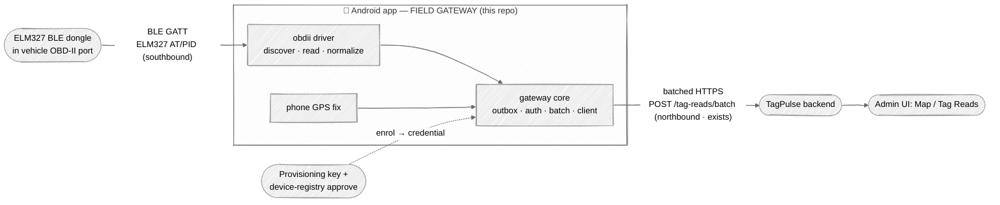

# Plan — OBDII-on-demand MVE (Phase-0, first gateway modality)

> **Status:** plan / proposal — **not committed scope** until approved (gates the
> `implementer`). **Intent:** a file-by-file, milestone-by-milestone build plan for the
> minimum viable experiment (MVE) named in
> [`edge-gateway-exploration.md` § MVE prospect](edge-gateway-exploration.md#mve-prospect--obdii-on-demand-candidate-first-gateway-modality).
> This plan does **not** relitigate the design decisions captured there or in
> [`mobile-client.md`](mobile-client.md) — it plans *within* them. On conflict, those
> design docs + the TagPulse `openapi.json` contract win.
>
> Contract facts below were re-verified against the sibling backend repo
> (`~/ws/TagPulse`, project `tagpulse`, `main` @ `06dde2b`) on 2026-07-24; claims that
> could **not** be pinned to backend code are marked **`unverified`**.

## Summary

Prove the phone-as-field-gateway thesis with the cheapest possible end-to-end slice:

> **Android app** BLE-connects a **~$25–30 ELM327-over-BLE OBD-II dongle** → reads four
> J1979 PIDs (RPM, speed, coolant temp, fuel %) → normalizes a snapshot → drops it in a
> durable **outbox** → drains it as a batched **`POST /tag-reads/batch`** (the phone's
> provisioned **device_id**, GPS in the `location` sub-model) → the read appears on the existing
> **Map**.

It is deliberately **green-zone**: it uses the *existing* `tag-reads` ingest path with
**zero backend change**, models the vehicle as an **asset**, and runs **opportunistic /
foreground** (user taps "Scan vehicle") — so no `I-75YC` telemetry-principal ask, no
`I-9HQA` position-generalization ask, no always-on/background/battery fight. It exercises
the reusable **gateway core + thin `obdii` driver** seam for the first time on real
hardware, **Android-first** (resolves `Q-C` for this slice; iOS port follows on a
confirmed-BLE adapter).


<sub>Regenerate: edit the Mermaid above. Context-0 view; boundaries = trust/ownership zones.
Dongle & backend & UI are external (stadium) nodes; the phone box is the trust boundary this repo owns.</sub>

---

## 1. Goal & done-definition (acceptance criteria)

The MVE **works** when, on a single Android handset paired to a real (or emulated) ELM327
BLE dongle, an operator can:

| # | Acceptance criterion | Verification signal |
|---|---|---|
| A1 | Enrol the handset (provision → approve for the `device_id`), and provision a **tenant user API key (`tp_{slug}_…`)** out-of-band onto the device; hold both in the Android Keystore. Ingest is authenticated with **`Authorization: Bearer tp_{slug}_…`** — *not* a device token (see §5 🚩). | `POST /devices/provision` returns `device_id`; admin approve flips status → `active`; a `POST /tag-reads/batch` with the tenant key returns `201`; credentials present in secure store, never in logs. |
| A2 | Discover + BLE-connect the dongle and complete the ELM327 init handshake. | Driver logs `ATZ`/`ATE0`/`ATSP0` round-trip; connection state = `connected`. |
| A3 | Read all four PIDs in one on-demand snapshot and normalize them to engineering units. | Unit test: canned ELM327 hex frames → expected `{rpm, speed_kph, coolant_temp_c, fuel_level_pct}`; a real read shows plausible values. |
| A4 | Persist the snapshot to the durable outbox and survive a process restart with it still queued. | Instrumented test: enqueue → kill process → relaunch → item still pending. |
| A5 | Drain the outbox as a batched **`POST /tag-reads/batch`** and get a `201`. Delivery is **at-least-once** (§4/§7): a lost `201` may re-send and duplicate — acceptable for the MVE. | HTTP `201`; backend returns **`{ingested: N, rejected: 0}`** (`ingestion.py:38-52`); outbox row transitions `pending → sent`; a forced retry produces a duplicate row (documented, not a failure). |
| A6 | See the read on the existing TagPulse **Map** / **Tag Reads** grid at the phone's GPS location. | Manual: the pin appears; the PID snapshot is present in the row's `sensor_data`. |
| A7 | **Asset link is testable:** after a relayed read, the vehicle appears in the current-locations view (requires a `binding_kind='device'` binding — §5). | E2E fixture: seed a vehicle asset + a `binding_kind='device'` binding whose `binding_value` = the `tag_id` the phone reports; relay a read; assert `GET /assets/current-locations` (`assets.py:130-145`) returns the vehicle at the read's location. |
| A8 | The per-platform gate is green. | `./gradlew lintDebug testDebugUnitTest assembleDebug` exits 0. |

**Non-acceptance (explicitly not required):** clean telemetry model, non-asset subjects,
background operation, multi-vehicle fan-in, DTC/VIN. See §2.

---

## 2. Scope

### In scope
- One **Android** app shell (foreground, user-initiated "Scan vehicle" action).
- A **gateway core** module (outbox · auth/credential · batching · backend client) and a
  thin **`obdii` driver** (`discover → read → normalize`) behind a common interface.
- BLE GATT transport to an **ELM327-over-BLE** dongle; the J1979 numeric-PID happy path
  for **exactly four PIDs**: `010C` RPM, `010D` speed, `0105` coolant temp, `012F` fuel %.
- Enrolment via the existing provision → approve flow; **plus an out-of-band tenant user
  API key (`tp_{slug}_…`)** as the ingest credential (§5 🚩); both in Android Keystore.
- **A `binding_kind='device'` binding** (vehicle asset ↔ the `tag_id` the phone reports)
  registered as a setup prerequisite — **required** for the vehicle to surface on the
  Map / current-locations view (§5, Fix 3; `binding_kind` enum `schemas.py:890`).
- Relay via **`POST /tag-reads/batch`** (batch drain; single `POST /tag-reads` only for
  manual one-off testing), snapshot in `sensor_data`, GPS in the `location` sub-model.

### Out of scope (mirrors the prospect's exclusions)
- **Clean telemetry model** `POST /telemetry/readings/ingest` — admin/editor-gated, needs
  the scoped-gateway-principal ask (ledger **`I-75YC`**). *Later upgrade, not MVE.*
- **Non-asset subjects / position-generalization** (ledger **`I-9HQA`**) — vehicle = asset,
  so asset-scoped paths work as-is.
- **Always-on / mounted / background** deployment mode.
- **Multi-subject fan-in at scale** (many dongles / mixed-subject batches).
- **DTC** (diagnostic trouble codes — *events*) and **VIN** (*identity*) — outside the
  numeric-PID happy path.
- **iOS** — deferred to a follow-up port on a confirmed-BLE adapter.

---

## 3. Architecture — the core/driver seam

The whole point is to build the **portable gateway core once** and add modalities as
**drivers, not new SDKs** (per
[exploration § Generalized gateway core](edge-gateway-exploration.md#generalized-gateway-core--per-modality-drivers-the-reusable-idea)).
The MVE stands up that seam with its first driver.

```
app (Android UI: "Scan vehicle" button, status)
  │  calls
  ▼
gateway core  ── reused by every future modality ──────────────────┐
  • Outbox        durable local queue (Room), size + age capped     │
  • Credential    provision/approve + Keystore-backed ingest cred   │
  • Batcher       drains pending items → batched POST               │
  • BackendClient generated from openapi.json (records backend SHA) │
  • GatewayDriver interface:  discover() → read() → normalize()     │
  └────────────────────────────────────────────────────────────────┘
  ▲  implements
  │
obdii driver  ── the ONLY MVE-specific code ──
  • BleTransport      GATT connect, notify/write chars, MTU, timeouts
  • Elm327Session     AT init + PID request/response framing
  • PidCodec          hex frame → engineering units (pure, unit-tested)
  • normalize()       → the core's Observation model (subject + source)
```

**Where the seam is:** the `obdii` driver knows nothing about HTTP, auth, or the outbox;
the core knows nothing about BLE or ELM327. They meet at a single `GatewayDriver`
interface returning a normalized `Observation { subject, source, timestamp, payload,
location }`.

**Reused later (not rewritten):** outbox, credential/enrolment, batcher, backend client,
the driver interface, and the `Observation` shape all carry forward to camera/NFC/BLE-beacon
modalities and (much later) the clean telemetry path. Only a *new driver* is needed per
modality. The **cheap hedge** from
[exploration § Sequencing](edge-gateway-exploration.md#sequencing) is honored: every outbox
item keys an explicit **`subject` + `source`**, never an implicit "self."

---

## 4. Data mapping — OBD PIDs → `TagReadCreate`

**Verified `TagReadCreate` shape** (`~/ws/TagPulse` `src/tagpulse/models/schemas.py`):
`device_id: UUID` (required), `tag_id: str|None ≤256`, `timestamp: datetime`,
`signal_strength: float|None`, `sensor_data: dict|None`, `location: Location|None`,
`identity: Identity|None`, `tag_data: dict|None`, `reader_antenna: int|None (0–255)`.
`Location` = `{latitude (−90..90), longitude (−180..180), accuracy_m: float|None ≥0,
source: Literal["gps","fixed","inferred","reader_gnss"] = "gps"}`.

> ⚠ **Correction to carry forward:** the sub-model field is **`accuracy_m`** (not
> `accuracy_meters`) and `source` is a fixed `LocationSource` enum — the MVE's GPS stamp
> uses `source: "gps"`. Noted so the generated-client mapping doesn't drift.

| `TagReadCreate` field | MVE value | Note |
|---|---|---|
| `device_id` | the **phone-gateway's** provisioned device UUID | The gateway is the reporting device (§5). Obtained at enrolment, cached in secure store. |
| `tag_id` | the **vehicle asset's** `binding_value` for its `binding_kind='device'` binding | **Required for Map visibility (Fix 3).** The current-locations view joins `binding_kind='device' AND tr.tag_id = b.binding_value` (`migrations/versions/057_epc_binding_match_hex.py`). EPC/TID bindings would need `identity.epc`/`identity.tid` (which the MVE leaves unset) → an EPC-bound vehicle would **never** appear. So the vehicle **must** carry a `device`-kind binding whose value = this `tag_id` (registered at setup, §5). If the binding is absent, the read still lands + shows a raw pin via `location`, but is **not linked to the asset**. |
| `timestamp` | snapshot capture time (UTC) | Clock hygiene: backend rejects >24 h old / >5 min future and dead-letters them (edge-device-contract §3.5) — the outbox drops stale items locally first (mirrors [`mobile-client.md` Time hygiene](mobile-client.md#architecture)). |
| `sensor_data` | the **PID snapshot JSON** (below) | The green-zone home for the OBD payload — no backend change. |
| `location` | phone GPS fix → `{latitude, longitude, accuracy_m, source:"gps"}` | Drives the Map pin (A6/A7). On-demand single fix, not a track. |
| `signal_strength` | *(optional)* BLE RSSI of the dongle link | Free, mildly useful; omit if noisy. |
| `identity` / `tag_data` / `reader_antenna` | unused (MVE) | RFID-specific; leave `null`. |

**Proposed `sensor_data` snapshot shape** (stable, self-describing so a later reader can
tell it came from the OBD modality):

```json
{
  "modality": "obdii",
  "protocol": "elm327/j1979",
  "captured_at": "2026-07-24T21:00:00Z",
  "pids": {
    "rpm":            850,
    "speed_kph":      0,
    "coolant_temp_c": 89,
    "fuel_level_pct": 47.5
  },
  "dongle": { "ble_name": "OBDII", "adapter": "elm327", "elm_version": "1.5" },
  "raw": { "010C": "41 0C 0D 48", "010D": "41 0D 00" }
}
```

- `pids` = the normalized engineering-unit values (the point of the read).
- `raw` = the source ELM327 frames, **optional / debug-gated** — invaluable for
  field-debugging clone quirks (§9) but droppable to stay within footprint.
- `modality`/`protocol`/`captured_at` = provenance so the payload self-identifies.

**On-demand snapshot semantics:** one user-initiated action = **one** snapshot = **one**
`tag_read` row (or a small batch if several PIDs are split). Not a stream; no sampling loop
in the MVE.

**Delivery semantics — at-least-once (Fix 4).** `TagReadCreate` carries **no client event
id**, and the backend assigns a fresh server-side UUID per insert (`id=uuid.uuid4()`,
`src/tagpulse/ingestion/service.py:258`). So a lost `201` on retry **duplicates** the
snapshot — **exactly-once is unachievable** without a backend idempotency key. The MVE
**accepts at-least-once** delivery (a duplicate PID snapshot is harmless). Client-side
dedup / idempotency is **out of scope** → a future backend ask (idempotency key on ingest);
see [Backend dependencies (post-MVE)](#backend-dependencies-post-mve).

---

## 5. Enrolment / binding flow

Two distinct bindings — **handset↔tenant** (once) and **dongle↔vehicle-asset** (per
vehicle). Both use *existing* backend primitives (re-verified in
`src/tagpulse/api/routes/provisioning.py`):

**Handset enrolment (once per phone):**
1. `POST /devices/provision` with an `X-Provisioning-Key` header → returns
   `{device_id, status: "pending", message}` — **no token** (`provisioning.py`). The key is
   a **tenant** provisioning key, entered once at setup (QR scan is the intended UX, per
   `mobile-client.md`).
2. Admin approves: `POST /device-registry/{device_id}/approve` (admin-only, `204`) →
   status `active`.
3. **Ingest credential (Fix 1 — DECIDED):** the handset authenticates its
   `POST /tag-reads/batch` with an **out-of-band tenant user API key (`tp_{slug}_…`)**,
   sent as `Authorization: Bearer tp_{slug}_…`, provisioned manually onto the device at
   setup. Cache `device_id` **and** that key in the **Android Keystore** — never in source,
   resource files, or logs (AGENTS §2).

> 🚩 **Why a tenant key, not a device token (code-verified).** The device-token machinery
> exists — `generate_device_token()` mints a `tpd_{slug}_…` token (`user_auth.py:101`),
> `POST /device-registry/{id}/rotate-token` sets `DeviceModel.token_hash`
> (`devices.py:116-144`, `database.py:147`) — **but ingest auth never verifies it.**
> `get_current_user` (`user_auth.py:137-210`) only routes `Bearer tp_…` (user API key) or a
> JWT (any `Bearer` **not** starting with `tp_`) or the legacy `X-Tenant-ID` header. A
> `tpd_` token does **not** start with `tp_`, so it is misrouted to JWT decode → `401`.
> Therefore Phase-0 uses the **tenant user API key** workaround.
>
> **Security caveat (accepted for the MVE):** a `tp_{slug}_…` key is **tenant-scoped and
> broad** — it authorizes far more than one device's ingest, and there is **no per-device
> revocation** (rotating it affects every holder). Keep it in the Keystore, treat it as
> sensitive, and scope its blast radius operationally (dedicated low-privilege user where
> possible). The proper fix is post-MVE — see
> [Backend dependencies (post-MVE)](#backend-dependencies-post-mve) (ledger **`I-K6D1`**).

**Dongle ↔ vehicle-asset binding (per vehicle):**
- The **BT pairing/bonding** of phone↔dongle is a **possession proof** → per the tiered
  trust decision (`D-AZ5E`, exploration G-1), a bonded dongle can **auto-bind**; no
  BLE-passive approval step is needed for this modality.
- **Required backend binding (Fix 3 — DECIDED):** the vehicle asset **must** carry an
  `asset_tag_bindings` row with **`binding_kind='device'`** whose `binding_value` equals the
  `tag_id` the phone reports (§4). The current-locations view resolves the asset via
  `binding_kind='device' AND tr.tag_id = b.binding_value`
  (`migrations/versions/057_epc_binding_match_hex.py`); an EPC/TID binding would require
  `identity.epc`/`identity.tid` (unset in the MVE) and so would **never** surface the
  vehicle. Registering this `device`-kind binding is an explicit **enrolment/setup
  prerequisite** (admin action; `binding_kind` enum = `Literal["epc","tid","device"]`,
  `schemas.py:890`).
- Associating the dongle (BLE address) with the vehicle's `tag_id` is, on the phone side, a
  **local, operator-confirmed** mapping (select/enter the vehicle at first connect); a
  backend-side dongle registry is out of scope (OQ-3).
- **Provisioning key source:** the tenant admin issues it (same key that provisions any
  device); delivered to the handset via QR at setup.

## Backend dependencies (post-MVE)

Not MVE blockers — the MVE ships on the workarounds above — but the clean fixes, handed to
the `tagpulse` backend:

- **`I-K6D1` — wire `tpd_` device-token verification into ingest auth**, and have
  `provision`/`approve` **mint + return** the device token (today they return neither). This
  replaces the tenant-key workaround (Fix 1) with a per-device, revocable credential.
  **Distinct from `I-75YC`** (which is the *telemetry*-ingest scoped-gateway principal, a
  different endpoint + authz surface).
- **Idempotency key on ingest** (future ask) — a client-supplied event id so retries
  dedup, upgrading Fix 4's at-least-once toward exactly-once.
- (Already tracked) **`I-75YC`** scoped gateway principal for `POST /telemetry/readings/ingest`;
  **`I-9HQA`** position-generalization — both out of MVE scope (§2).

---

## 6. Android BLE specifics

ELM327-over-BLE dongles expose a **GATT** service with a **write** characteristic (send AT
/ PID commands) and a **notify** characteristic (receive the ASCII response, `>`-prompt
terminated). The exact UUIDs and framing are **dongle-specific** — the driver must
discover, not hard-code.

| Concern | Plan | Confidence |
|---|---|---|
| Discovery / connect | `BluetoothLeScanner` filter → `connectGatt()` → `discoverServices()`. | standard Android BLE |
| Service / char UUIDs | **Discover at runtime**; common clones use a Nordic-UART-like pair, but this **varies by dongle** → `unverified`, keep in config. | `unverified` (dongle-specific) |
| Notify + write | Enable notifications on the notify char (write the CCCD descriptor); write commands to the write char; reassemble notify fragments until the `>` prompt. | `unverified` framing details |
| MTU | Request a larger MTU (e.g. 185/247) after connect; **do not assume it's granted** — reassemble across notifications regardless. | standard; grant `unverified` |
| ELM327 init | `ATZ` (reset) → `ATE0` (echo off) → `ATL0`/`ATS0` (formatting) → `ATSP0` (auto protocol) → then PID requests (`010C`, `010D`, `0105`, `012F`). | J1979 / ELM327 datasheet |
| Timeouts / reconnect | Per-command timeout (e.g. 2–5 s) with a bounded retry; on GATT disconnect, a single reconnect attempt then surface a clear error (foreground UX). | design choice |
| Response parsing | Strip echoes/whitespace/`>`; validate the `41 <pid>` positive-response header before decoding; treat `NO DATA`/`?`/`UNABLE TO CONNECT` as per-PID failures, not crashes. | J1979 |

**Emulator/test note:** the `PidCodec` is a **pure function** unit-tested against canned
hex frames (no hardware). The BLE/ELM327 session is validated on real hardware and, where
possible, a scriptable BLE mock; hardware-in-the-loop is a **manual** milestone check.

---

## 7. Offline-first outbox

Even though the MVE is on-demand, **every** observation goes through the durable outbox —
that is the core's whole reason to exist and what future modalities reuse.

- **Store:** Room (SQLite) table of outbox items; each row = `{id, subject, source,
  captured_at, payload_json, location_json, state, attempts, created_at}`. Keying by
  explicit **`subject` + `source`** is the [cheap gateway hedge](edge-gateway-exploration.md#sequencing).
- **Write-through:** the "Scan vehicle" action writes the snapshot inline and returns
  immediately; a drainer sends it. Process-restart safe (A4).
- **Drain:** batched **`POST /tag-reads/batch`** (body = `list[TagReadCreate]`; batch cap is
  500 server-side — irrelevant at MVE volume). Response **`{ingested, rejected}`**
  (`ingestion.py:38-52`); mark sent rows `sent`, keep `rejected` for inspection.
- **Retry/backoff:** full-jitter exponential backoff on network/5xx; a bounded attempt
  count then park as `failed` (surfaced in the UI, not silently dropped). **Delivery is
  at-least-once (Fix 4):** the backend assigns its own row UUID and accepts no client event
  id, so a lost `201` on retry duplicates the snapshot — accepted for the MVE (a repeated
  PID snapshot is harmless). No local "idempotency" claim; true dedup is a post-MVE backend
  ask (see [Backend dependencies](#backend-dependencies-post-mve)).
- **Caps (footprint budget):** cap by **size + age** — drop items older than the backend's
  24 h clock window *before* sending (avoids guaranteed dead-letter); bound total rows so a
  long offline stint can't grow unbounded. Exact numbers `unverified` until Phase-0 builds
  exist (per [`mobile-client.md` Footprint budget](mobile-client.md#footprint-budget-native-was-chosen-for-this--hold-the-line)).

---

## 8. Milestones / phased steps

Each milestone is a small, independently verifiable increment. The per-platform gate
`./gradlew lintDebug testDebugUnitTest assembleDebug` (AGENTS §3) must be green at **every**
milestone from M0 on.

| M | Deliverable | Verification signal |
|---|---|---|
| **M0 — Scaffold** | Android app skeleton (repo has *no* app code yet): Gradle project, `:gateway-core` + `:obdii` modules, the `GatewayDriver` interface + `Observation` model, generated backend client stubbed from `openapi.json` (record backend SHA). No behavior. | Gate green; module graph builds; `openapi.json` SHA recorded in-repo. |
| **M1 — BLE connect + one PID** | `BleTransport` + `Elm327Session`: connect the dongle, init handshake, read **RPM (`010C`)** only, log the value. | Manual HIL: RPM logged from a real dongle (or scripted BLE mock); connection state observable. |
| **M2 — Full snapshot + normalize** | Read all four PIDs; `PidCodec` decodes to engineering units; assemble the `sensor_data` snapshot model. | Unit test: canned hex frames → expected `{rpm, speed_kph, coolant_temp_c, fuel_level_pct}` (incl. `NO DATA`/error frames). |
| **M3 — Normalize → outbox** | Snapshot → `Observation` → durable Room outbox; restart-safe; NOT yet sent. | Instrumented test A4 (enqueue → kill → relaunch → still pending). |
| **M4 — Enrolment + relay** | Provision→approve for `device_id`; **tenant user API key (`tp_{slug}_…`) in Keystore** (Fix 1); batcher drains → **`POST /tag-reads/batch`**. | HTTP `201` + **`{ingested:1, rejected:0}`**; outbox row `pending → sent` (at-least-once, Fix 4) (A1, A5). |
| **M5 — Map confirmation (E2E)** | Wire the "Scan vehicle" UI action end-to-end; seed a vehicle asset + a **`binding_kind='device'`** binding (Fix 3); run the full slice against a dev tenant. | E2E fixture (A7): after a relayed read, **`GET /assets/current-locations`** returns the vehicle at the read's location; plus manual — pin on the Map, PID snapshot in the Tag Reads row (A6). |

**iOS port** is a *post-MVE* follow-up (own plan) once a confirmed-BLE adapter is in hand;
the `PidCodec` + core contracts are the reusable, portable parts.

---

## 9. Risks & open questions

**Risks**
- **ELM327 clone quirks** (`unverified`) — cheap dongles vary in AT support, framing, and
  reliability. Mitigation: keep the `raw` frames in `sensor_data` (debug-gated), discover
  UUIDs at runtime, and validate on the actual purchased adapter early (M1).
- **Per-vehicle PID support variance** — not every vehicle answers every PID; expect
  `NO DATA` for some. Mitigation: treat each PID independently; a partial snapshot is still
  a valid read.
- **BLE reliability** (`unverified`) — connection drops, MTU refusals, notify fragmentation.
  Mitigation: reassemble to the `>` prompt regardless of MTU; bounded reconnect; clear
  foreground error UX.
- **Hard-coding vs config** — GATT UUIDs / timing must be **config**, not constants, so the
  OBDLink MX+ production upgrade (an ELM327 superset) needs no driver rewrite.
- **Footprint** — Room + BLE + generated client add weight; hold the line per the design's
  footprint budget; numbers `unverified` until M0 builds exist.

**Open questions (surfaced for human/backend review)**
- **OQ-1 — device ingest credential — RESOLVED (Fix 1).** Confirmed a real gap: `tpd_`
  device tokens are never verified by ingest auth (`user_auth.py:137-210`). **Decision:**
  Phase-0 uses an out-of-band **tenant user API key** (§5); the clean device-token fix is
  post-MVE (ledger **`I-K6D1`**). *No longer blocking.*
- **OQ-2 — vehicle-asset ↔ read linkage — RESOLVED (Fix 3).** The read surfaces the asset
  **only** via a `binding_kind='device'` binding matching `tr.tag_id`
  (`migrations/versions/057_epc_binding_match_hex.py`). **Decision:** that binding is a
  required setup prerequisite (§2, §5); asserted by the A7 E2E fixture.
- **OQ-3 — dongle registry.** MVE binds dongle↔vehicle **locally** (operator-confirmed). Is
  a backend-side dongle/vehicle registry wanted before this leaves experiment status?
  *(Still open — a scope call, not a blocker.)*
- **OQ-4 — iOS adapter confirmation.** Which specific BLE dongle is confirmed to work with
  iOS Core Bluetooth for the eventual port? (Deferred, but drives the M-series hardware buy.)
- **OQ-5 — ingest idempotency.** At-least-once is accepted for the MVE (Fix 4). A backend
  idempotency key would let a later revision reach exactly-once — tracked under
  [Backend dependencies](#backend-dependencies-post-mve).

---

## Review attestations

<!-- SDLC gate — fill before merge -->

- **Plan-stage rubber-duck:** **round 1 ran → 4 blocking findings** (ingest-auth gap; batch
  endpoint/response mismatch; Map visibility requires a `binding_kind='device'` binding;
  at-least-once vs exactly-once). **This is the round-2 revision** addressing all four —
  each fix code-verified against `~/ws/TagPulse` and cited inline (file:line). Awaiting
  re-review acceptance before the plan gates implementation.
- **Diff-stage rubber-duck (M0 implementation, `feat/m0-scaffold` / PR #4):** **ran** on the
  M0 code diff. `verifier` verdict **"M0 conforms"** (scaffold-only, gate green); code-review
  **"no blocking issues"**. One **Medium, non-blocking** footprint finding — the "R8 strips
  unused generated models" mitigation is not yet load-bearing (release `isMinifyEnabled=false`)
  — tracked as ledger **`C-ZVMF`** (enable R8 + keep-rules, or trim the spec, before any
  release footprint acceptance; deliberately out of M0 scope to avoid an untested release
  path). Doc-accuracy fixes applied in a round-2 cleanup (serialization dependency line,
  145 component schemas vs 148 generated files, footprint claim marked `unverified`).
- **Diff-stage rubber-duck (M1 implementation, `feat/m1-ble-rpm` / PR #5):** **ran** on the
  M1 code diff. `verifier` verdict **"M1 conforms"** (gate green). Code-review found **2 real
  hardware-path bugs** — both **fixed in round-2**: (1) HIGH — `AndroidBleTransport.write()`
  can throw a *generic* `BleException` (rejected/unresolved write), which `Elm327Session`'s
  handshake loop + `requestRpm()` didn't catch → state stuck at Handshaking/Reading and
  `readRpm()` threw (violating its "never throws for a per-command problem" contract); now
  a `catch (BleException)` in both spots maps to `ObdError.LINK_ERROR` (state → Error;
  `readRpm()` never throws). (2) MED — `BluetoothGatt` leak: the `STATE_DISCONNECTED`
  callback + `reconnect()`'s bare `connect()` never closed the prior GATT → client-slot
  exhaustion on flaky links; now `gatt.close()` on drop + close-before-assign in `connect()`.
  Plus hardening: write-type chosen from the characteristic's actual properties
  (`WRITE`→with-response, else `WRITE_TYPE_NO_RESPONSE`), and `reconnect()` rethrows
  `CancellationException` (no swallowed cancellation). The unit gate stayed green pre-fix
  because `FakeBleTransport` only threw `BleDisconnectedException`; round-2 extended it with
  a generic-`BleException` hook (`throwOn`) + exercised the `dropAfter`/`connectCount`
  reconnect path — **+3 `Elm327Session` tests** (generic-`BleException` on read + handshake;
  drop→reconnect→recover). Gate green (23 unit tests, `failures=0 errors=0`). HIL
  RPM-from-hardware remains a manual check.
- **Diff-stage rubber-duck (M2 implementation, `feat/m2-snapshot` / PR #6):** **ran** on the
  M2 code diff. `verifier` verdict **"M2 conforms"** (5/5 checklist, gate re-run green with
  `--rerun-tasks`); code-review **"no blocking issues"** (verified by analysis + running the
  42 obdii tests). **No round-2 needed — zero code fixes.** Independently verified: the four
  J1979 decode formulas are correct in source (RPM `((A·256)+B)/4`; speed `A`; coolant
  `A−40`, negative-capable; fuel `A·100/255` as a one-decimal float — proper float math);
  `PidCodec.parseFrame` guards `NO DATA`/`?`/`UNABLE TO CONNECT`/wrong-header/odd-length
  frames (never throws); `readSnapshot()` degrades **gracefully** (one PID `NO DATA` → null
  field, others land, session ends `Ready`); and the `ObdSnapshot.toAttributes()/fromAttributes()`
  round-trip across the string-typed seam is **locale-safe** (`Float.toString()`/`String.toFloat()`
  are locale-independent). Reviewers judged the round-trip, the dead-`ObdReadException`
  removal, and the M1-`ObdiiDriverTest` schema update all **justified, no regressions**
  (M1 `readRpm`/session/reconnect tests retained + green). Gate green (**45 unit tests**,
  `failures=0 errors=0`). Scope held to M2 (no outbox/HTTP/GPS/enrolment/UI); `gateway-core`
  untouched.
- **Diff-stage rubber-duck (M3 implementation, `feat/m3-outbox` / PR #7):** **ran** on the
  M3 code diff. `verifier` verdict **"M3 conforms"** (6/6 checklist, gate re-run green — 157
  tasks; the 11 Robolectric outbox tests, incl. the A4 file-backed restart, demonstrably
  executed under `testDebugUnitTest`); code-review **"no blocking issues."** **No round-2 —
  zero code fixes.** Independently verified: the durable Room outbox is **file-backed** and
  `enqueue()` awaits the `suspend` insert so the row is committed before it returns
  (restart-safe); the `OutboxJson` round-trip is **locale-safe** and the documented
  `Float→Double` widening is wire-lossless; `deleteOldest`/`byState` order by
  `created_at ASC, id ASC` (never evicts the just-enqueued row) and age-purge keys on
  `captured_at` (the backend 24 h clock). One **non-blocking** finding (all three reviewers):
  `enforceSizeCap()`'s count-then-`deleteOldest` is **not atomic** → could over-evict ~2×
  under *concurrent* enqueues — can't bite in M3 (single on-demand write path), deferred to
  **M4** (fold into one `DELETE … WHERE id NOT IN (… LIMIT :maxItems)`), tracked as ledger
  **`C-1TQZ`**. Design choices judged sound: jackson runtime pulled M4→M3 (earlier, not extra
  footprint; `CONTRACT.md` updated, cross-refs `C-ZVMF`), converter-free flattened schema,
  and undriven M4 DAO methods (`updateStateAndAttempts`/`deleteById`, no callers). Scope held
  to M3 (no drainer/HTTP/retry-exec/credential/GPS/UI; only ever `PENDING`); no `app/`/`obdii/`
  changes. Gate green (**56 unit tests**, `failures=0 errors=0`).
- **Diff-stage rubber-duck (M4 implementation, `feat/m4-relay` / PR #8):** **ran** on the M4
  code diff. `verifier` verdict **"M4 conforms"** (6/6 checklist, gate re-run green; **41**
  `gateway-core` tests incl. the OkHttp **MockWebServer** backend-client suite + the
  Robolectric Room-backed `Drainer` suite, demonstrably executed under `testDebugUnitTest`);
  code-review **"no blocking issues."** **Round-2 applied 2 small fixes** (both non-behavioral
  to the happy path): (1) `DrainReport` now carries `rejected` and `drain()` sums the backend's
  `201 {rejected}` across batches — closes the plan §7 "keep rejected for inspection"
  observability gap (rows still commit `SENT`; there are no per-row ids to selectively fail and
  `purgeExpired` pre-drops clock-terminal rows — behavior unchanged, count surfaced;
  **+1 `DrainerTest`**). (2) `provisionDevice` default `device_type` corrected
  `"rfid_reader"` → **`"mobile_gateway"`** (a phone isn't an RFID reader; backend-verified
  free-form `str ≤50`, `schemas.py:142`) — kept as a caller-configurable parameter (provision
  test now pins the new default). Accepted design decisions (no change): the **thin OkHttp
  transport over the generated models** (AGENTS §2 models-stay-generated honored; rationale in
  `CONTRACT.md` "M4 transport decision"), the bounded retry **recursion** with full-jitter
  exponential backoff, and the **Keystore HIL boundary** (real `AndroidKeyStore` isn't faithful
  under Robolectric; relay logic driven by `FakeCredentialStore`). At-least-once (Fix 4) — no
  client idempotency key, a lost `201` re-sends+duplicates — verified documented + tested.
  Ledger **`C-1TQZ` resolved** (atomic single-statement `evictToCap`). Two **non-blocking**
  follow-ups deferred (logged to the ledger): `429`/`408` mapping to `Terminal` (**since fixed
  under `C-4T93`**, below), and a `401` parks rows `PENDING` indefinitely (M5 should surface it
  to the operator). Scope held to M4 (no app UI/GPS/E2E-Map/approval-automation/`tpd_`). Gate green
  (**42** `gateway-core` after round-2 = **85 total**; `failures=0 errors=0`).
- **Diff-stage rubber-duck (M5 implementation, `feat/m5-e2e` / PR #9):** **ran** on the M5
  code diff. `verifier` verdict **"M5 conforms"** (7/7 checklist, gate re-run green); the
  A7 E2E script's backend fidelity was **verified endpoint-by-endpoint against `~/ws/TagPulse`
  @ `06dde2b`** — the tenant `tp_` ingest+admin auth (a **single** `tp_` key routes both the
  asset/binding writes and the `tag-reads` POST), the `POST /categories` → `/assets` →
  `/assets/{id}/bindings` seed with `binding_kind='device'` (so `binding_value` = the phone's
  `tag_id`), the `POST /tag-reads/batch` shape (`sensor_data` + `location{accuracy_m, source:"gps"}`
  → `201 {ingested,rejected}`), and the `GET /assets/current-locations` assertion that the
  seeded vehicle appears at the read's location with `kind='geo'` (the `tag_id ↔
  binding_kind='device'` join). Script is **HIL / not run here** (no Docker in this WSL distro);
  the runnable procedure + exact run steps are documented in `scripts/e2e/README.md`.
  code-review **"no blocking issues."** **Round-2 applied 2 small hardenings** (both make the
  coordinator's documented contract airtight; no happy-path behavior change): (1) the
  `enqueue → drain` tail of `ScanCoordinator.scan()` is now wrapped so an **unexpected**
  exception (e.g. a catastrophic Room write failure) rethrows `CancellationException` first,
  else lands as a terminal `ScanState.Error(INTERNAL, <secret-free msg>)` (the mutex still
  unlocks) — previously it could strand `Reading`/`Relaying` and propagate out of the UI
  coroutine, violating the "every outcome lands in state; only cooperative cancellation
  propagates" contract (**+2 coordinator tests**: a throwing `Outbox` insert and a throwing
  `Relay.drain` both end `Error(INTERNAL)`, no propagation). (2) the `report.failed > 0` relay
  message was corrected — `FAILED` rows are **terminal** (the drainer only reprocesses
  `PENDING`), so the old "stay queued for retry" wording was wrong; now "Relay failed: N read(s)
  could not be delivered after retries (check connectivity / the backend)." (The credential-error
  branch is unchanged — those rows genuinely stay `PENDING`; this closes ledger **`C-5EHY`** by
  surfacing `DrainReport.credentialError` to the operator as a re-enrol/check-key message.)
  Accepted design decisions (no change): the composition-root deps `:app` names
  (`room-runtime`/`okhttp`/`jackson-databind`) are `gateway-core`'s runtime-encapsulated
  `implementation` types already in the merged APK → **no footprint change**; and
  `LocationProvider`'s Android impl uses **`LocationManager` not Fused** (avoids the Google
  Play Services dependency / footprint budget). One **non-blocking** follow-up deferred (logged
  to the ledger) — **`C-RYH7`**: `AppContainer` carries placeholder constants
  (`DEFAULT_BASE_URL`/binding value) pending the real enrol/bind UX needed for the real-device
  A6/A7 HIL. **MVE acceptance after M5:** A1–A5 **code-complete** (real creds/backend are HIL);
  A6/A7 **HIL** + a runnable A7 script; **A8 gate green**. Scope held to M5 (no Tracker/background
  mode, iOS, multi-vehicle fan-in, DTC/VIN). Gate green (**app 10 + gateway-core 42 + obdii 42 =
  94 total**; `failures=0 errors=0`).
- **Diff-stage rubber-duck (this plan doc, docs-only):** n/a — this plan/proposal change is
  **docs-only**. Per AGENTS §6 the docs carve-out applies (no deps/CI/IaC/security/behavioral
  config touched), **but** this plan **gates** the Phase-0 implementation, which is *not*
  carved out — the implementer's diff-stage rubber-duck is required there (recorded above).
- **Follow-up chore `C-4T93` (relay `429`/`408` → retryable, `fix/relay-429-408-retryable`):**
  **plan-stage rubber-duck ran → 1 blocking finding** — the initial plan clamped `Retry-After`
  *down* to `maxBackoff`, which would retry a `429` prematurely and eventually exhaust
  `maxAttempts`, failing rows the server would still accept. **Revised before implementing:** a
  `Retry-After` **> `maxBackoff` now defers** (batch stays `PENDING`, no attempt counted, drain
  stops for a later pass, surfaced via `DrainReport.retryAfterMillis`); a `Retry-After`
  ≤ `maxBackoff` is honored verbatim in the existing bounded-retry loop. **Diff-stage code-review
  ran → no blocking issues**; one **Low** defensive edge case applied (clamp `seconds * 1000`
  against `Long` overflow so an absurd header can't wrap negative and defeat the defer check).
  Verified independently: `Retryable.retryAfterMillis` is a trailing `= null` param (backward
  compatible — all existing construction sites + `is Retryable` matches unaffected); the `when`
  order (`401`/`408`/`429`/`5xx`/`else`) can't misroute; attempts accounting for the
  ≤ `maxBackoff` path is unchanged. Gate green (**`gateway-core` 48** after **+6 tests** — 4
  client status-map + 2 drainer honor/defer; lint clean; `failures=0 errors=0`). Also **resolved
  `C-1TQZ`** — already implemented+tested (atomic `evictToCap` + the `atomic cap does not
  over-evict` test) in merged PR #8; ledger chore was stale. Scope held to `gateway-core` relay
  (no app/obdii/UI). **current-state:** not-affected (thin doc; internal retry-mapping refinement
  doesn't move the high-level snapshot).
